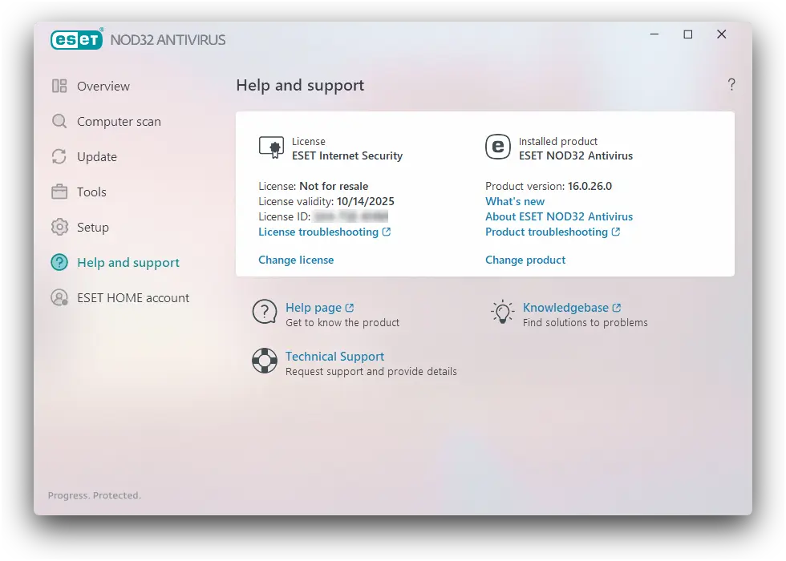
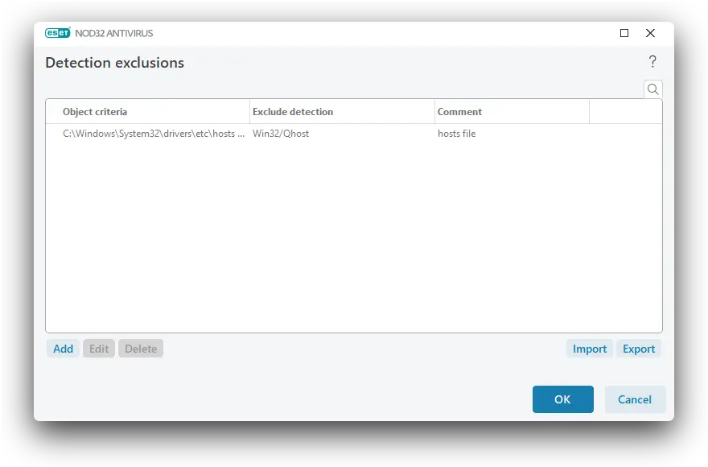
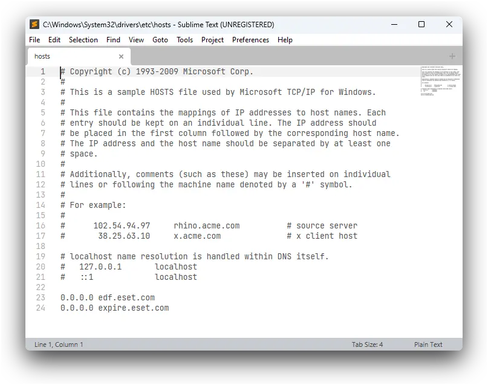
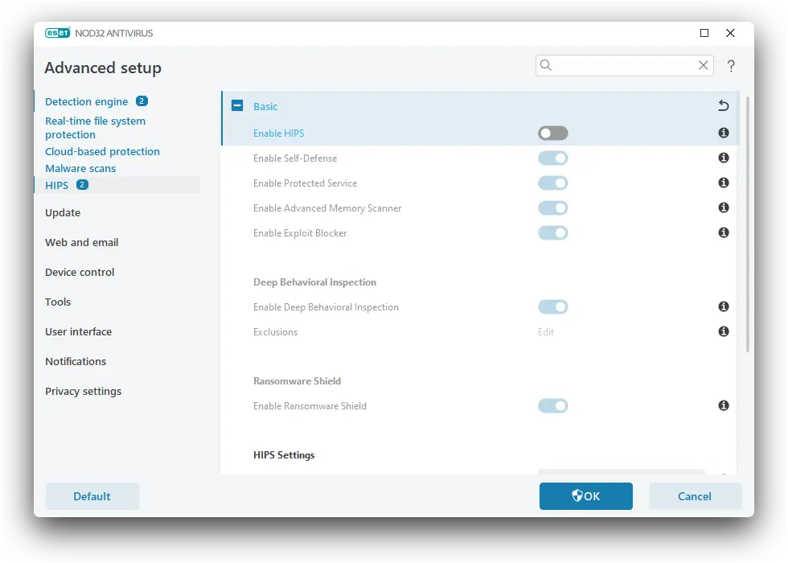
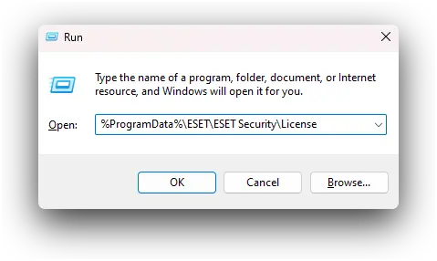
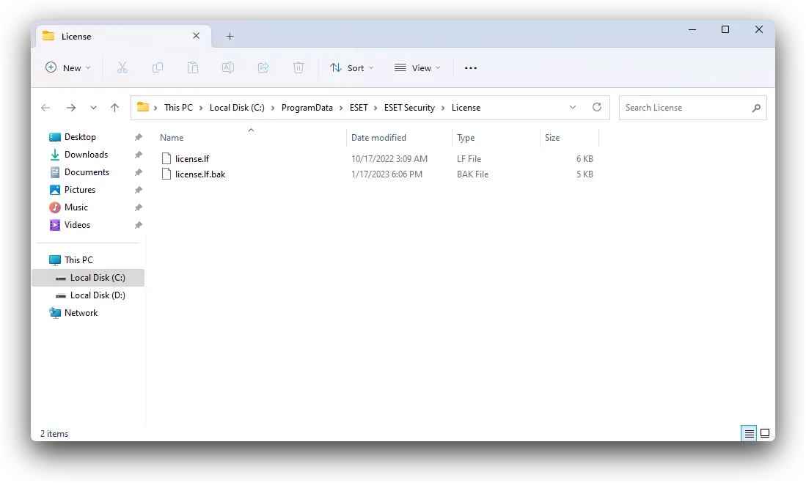
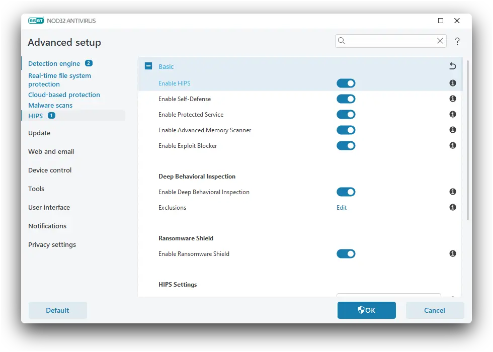
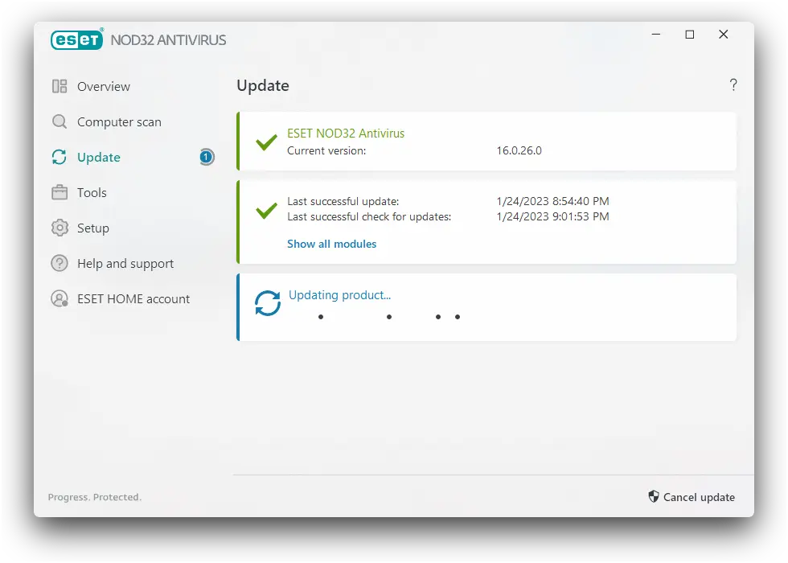

{}

## Dimana mendapatkan License.lf?



Dimana download **license.lf** nya gan? Kontak: rmdhnreza@proton.me

Mengapa harus via E-Mail lisensi nya? Waktu itu saya share di blog ini dan banyak yang share di YouTube juga, gak lama kemudian lisensi nya kena razia.

{} Cara ini lumayan kompleks, dan kamu memerlukan restart Desktop/Laptop {}

## Block Hosts

{} Sebelum melakukan Block Host pastikan Antivirus ESET nya terinstall terlebih dahulu, jika tidak maka akan terjadi error pada saat penginstallan ! {}

1. kamu masukan file **hosts** ke **Detection exclusions** ESET, caranya:

   1.1. Masuk ke **Setup** dan pilih **Advanced Setup**, atau kamu cukup tekan `F5`

   1.2. Pilih pada **Detection engine** scroll kebawah sampai bagian **Exclusions**

   1.3. Pada bagian **Detection exclusions** klik **Edit** untuk membuka *windows* **Detection exclusions**

   1.4. Setelah muncul *windows* **Detection exclusions** pilih **Add**

   1.5. Pada kolom **Detection name** masukan **Win32/Qhost**

   1.5. Pada kolom **Hash** & **Comment** kalian boleh kosongkan.

   1.6. Pada kolom **Path** masukan baris dibawah ini

```md
C:\Windows\System32\drivers\etc\hosts
```




2. Edit file `C:\Windows\System32\drivers\etc\hosts` menggunakan notepad atau *text editor* lainnya jangan lupa kamu **Run As Admin** notepad atau *text editor* yang kamu pakai.

   Tambahkan baris berikut ini di paling bawah & Save.

```md
0.0.0.0 edf.eset.com
0.0.0.0 expires.eset.com
```



## Setting ESET

1. **Disable HIPS ESET**

```md
Setup -> Advanced Setup -> HIPS -> Enable HIPS -> Off kan -> Restart Desktop/Laptop
```

{} Jangan browsingan, buka crack, dll. Soalnya cukup berbahaya juga jikalau HIPS nya lagi di matikan {}



2. Tekan shortcut **Win + R** untuk buka windows *Run*, masukan `%ProgramData%\ESET\ESET Security\License`, jika *folder not found*, kamu masukan `%ProgramData%\ESET\ESET Security` dan buat disana folder `License` (dengan huruf L besar)



3. Nanti ada 1 file **license.lf**. kamu boleh hapus, rename, atau timpa dengan **license.lf** yang sudah saya kasih via email.

{} Jika tidak bisa dihapus, rename atau ditimpa, berarti belum di disable HIPS nya, ulangi lagi langkah 1! {}



4. **Enable HIPS ESET**

```md
Setup -> Advanced Setup -> HIPS -> Enable HIPS -> On kan -> Restart Desktop/Laptop
```



6. *Update Database* ESET nya.



## Penutup

Udah dicoba dari awal ESET mulai gencar-gencarnya razia *license* dan masih bisa update *Database* ESET nya sampai postingan ini dibuat, sayangnya cara ini tidak bisa ganti product (misalnya dari NOD ke EIS, pasti muncul error).

Kalau misalnya kamu ingin ganti *product*, *uninstall* dulu ESET nya via **safe mode** menggunakan [ESET Uninstaller](https://support.eset.com/en/kb2289-uninstall-eset-manually-using-the-eset-uninstaller-tool), lalu kamu install lagi ESET nya dengan *product* yang akan kamu pakai. Untuk aktivasi ESET nya bisa menggunakan langkah diatas. Cara ini sudah saya coba di NOD32 dan EIS, bisa dua-dua nya.