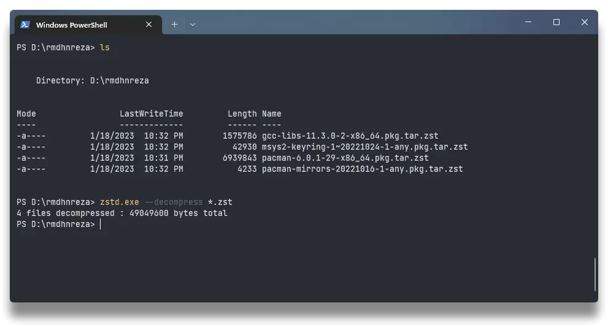
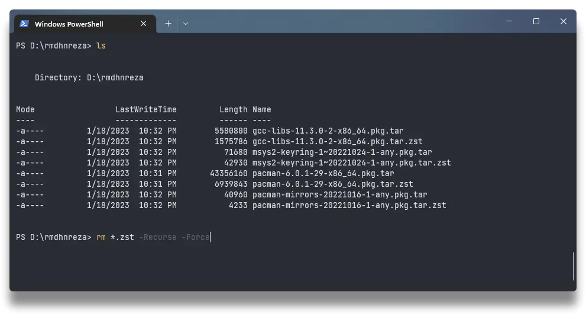
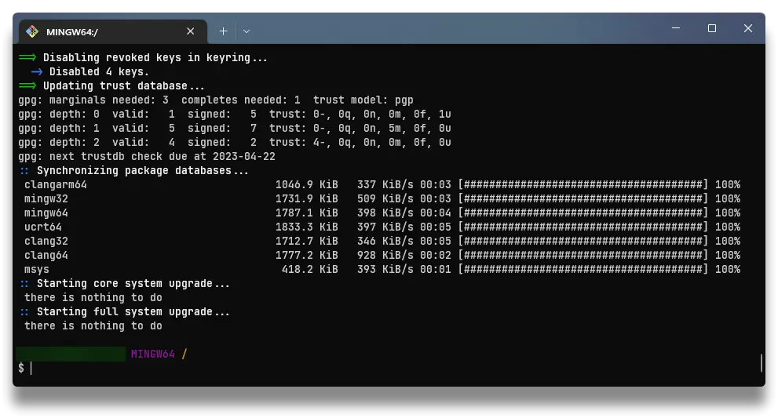
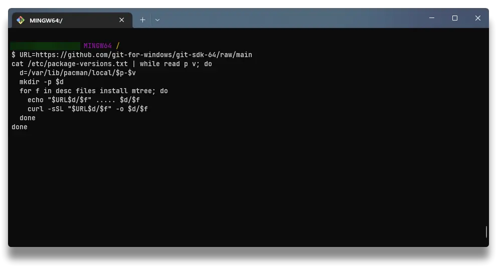
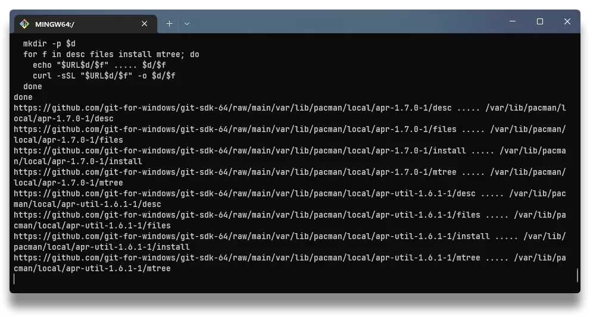
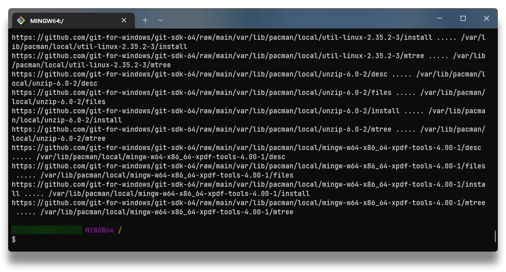
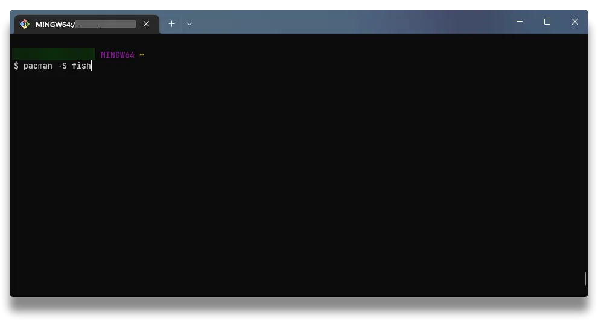
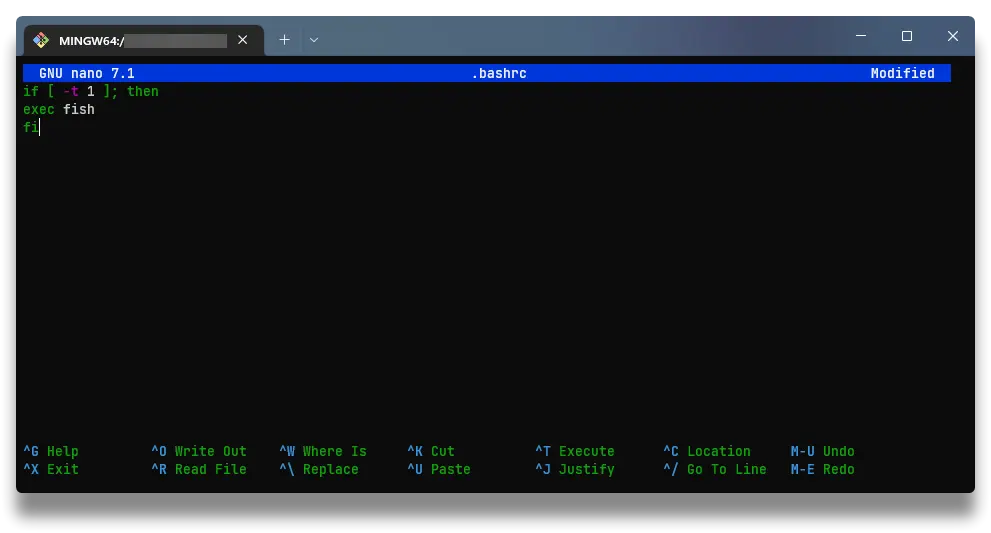
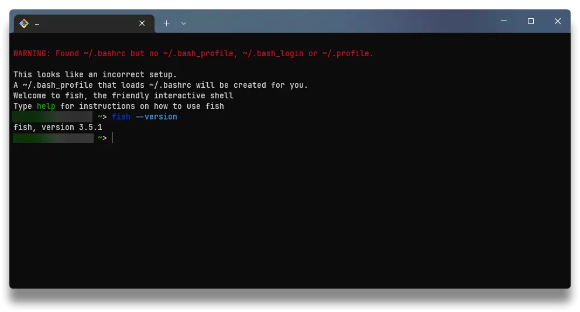
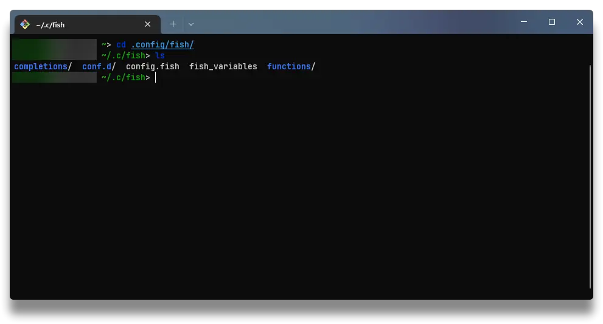

{}

Sebelumnya saya sudah pernah bahas [Cara Install Oh My Zsh di Windows 10](https://rmdhnreza.my.id/cara-install-oh-my-zsh-di-windows-10/). Kali ini kita akan bahas lagi tutorial cara install **Fish Shell** di sistem operasi berbasis Windows. Sama seperti [Cara Install Oh My Zsh di Windows 10](https://rmdhnreza.my.id/cara-install-oh-my-zsh-di-windows-10/) tutorial ini pun menggunakan **Git for Windows**

## Install Git for Windows

1. Install [Git for Windows](https://git-scm.com/download/win) sesuai dengan sistem operasi yang kamu pakai apakah 32/64 Bit, jika kalian menggunakan [scoop](https://rmdhnreza.my.id/cara-menginstall-package-manager-scoop-di-windows-10/), kalian bisa lewati langkah ini.

## Install Pacman

2. Download [pacman](https://packages.msys2.org/package/pacman?repo=msys), [pacman-mirrors](https://packages.msys2.org/package/pacman-mirrors?repo=msys) & [msys2-keyring](https://packages.msys2.org/package/msys2-keyring?repo=msys) dari situs MSYS2. Selain itu, agar `Fish` dapat dijalankan, kalian perlu mengunduh [gcc-libs](https://packages.msys2.org/package/gcc-libs?repo=msys&variant=x86_64) karena menggunakan `msys-stdc++-6.dll`

3. File-file tersebut dalam format zst. Untuk melakukan *extract* ke format tar, bisa menggunakan [zstd versi windows](https://github.com/facebook/zstd/releases), untuk pengguna [scoop](https://rmdhnreza.my.id/cara-menginstall-package-manager-scoop-di-windows-10/) kamu bisa menggunakan perintah `scoop install zstd` untuk menginstall [zstd](https://github.com/facebook/zstd/releases) setelah aplikasinya terinstall [zstd](https://github.com/facebook/zstd/releases) nya, jalankan perintah berikut ini dari cmd/powershell `zstd -d *.zst` berhasil di *extract* akan muncul 4 file baru dengan format tar.

 

4. Sekarang kita buka **Git Bash** nya dan jalankan perintah dibawah ini untuk *extract* file tar ke **Git Bash**

```md
cd /
tar -xvf ~/Downloads/msys2-keyring-1_20210213-2-any.pkg.tar
tar -xvf ~/Downloads/pacman-mirrors-20210423-2-any.pkg.tar
tar -xvf ~/Downloads/pacman-6.0.0-2-x86_64.pkg.tar
tar -xvf ~/Downloads/gcc-libs-10.2.0-1-x86_64.pkg.tar
pacman-key --init
pacman-key --populate msys2
pacman -Syu
```

{} Pastikan PATH untuk file tar nya benar! {}

{}

 

5. Untuk menyinkronkan file metadata, kamu perlu menjalankan perintah di bawah ini. Langkah ini memerlukan waktu beberapa menit untuk menyelesaikannya tergantung pada kecepatan internet kamu juga.

```bash
URL=https://github.com/git-for-windows/git-sdk-64/raw/main
cat /etc/package-versions.txt | while read p v; do
  d=/var/lib/pacman/local/$p-$v
  mkdir -p $d
  for f in desc files install mtree; do
    echo "$URL$d/$f" ..... $d/$f
    curl -sSL "$URL$d/$f" -o $d/$f
  done
done
```

  

{}

## Install Fish

6. Setelah pacman terinstal pada **Git Bash**, `Fish` dapat diinstal:

```bash
pacman -S fish
```



7. Jika semuanya berjalan dengan baik dan berfungsi dengan baik, buat *file* dengan nama `.bashrc ` di `%USERPROFILE%` atau `C:\USERS\USERNAME\.bashrc` dan tambahkan baris-baris berikut untuk menjadikan `Fish` sebagai shell default:

```bash
if [ -t 1 ]; then
  exec fish
fi
```

 

8. Untuk lokasi config nya sama seperti di sistem operasi Linux yaitu di `$HOME/.config/fish`

 

Itulah tutorial [Install Fish Shell di Windows 10 atau 11](https://rmdhnreza.my.id/install-fish-shell-di-windows-10-11/) jika ada yang ditanyakan silahkan berkomentar dibawah ya!

Sumber tutorial ini diambil dari: [gist.github.com/rafaelpadovezi](https://gist.github.com/rafaelpadovezi/1cfc1026f78255458f5a2ea56291ed23)