{}

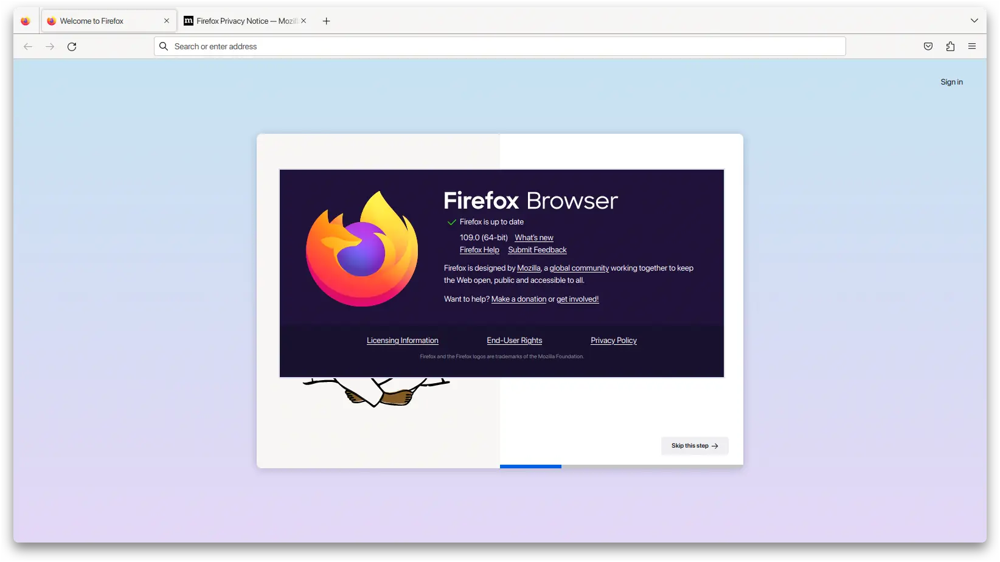

[Firefox 109.0](https://www.mozilla.org/en-US/firefox/109.0/releasenotes/) releases on **January 17, 2023**, the biggest change in this version is [Manifest Version 3 (MV3)](https://blog.mozilla.org/addons/2022/11/17/manifest-v3-signing-available-november-21-on-firefox-nightly/) extension support is now enabled by default ([MV2 remains enabled/supported](https://blog.mozilla.org/addons/2022/05/18/manifest-v3-in-firefox-recap-next-steps/)). This major update also ushers an exciting user interface change in the form of the [new extensions button](https://support.mozilla.org/kb/unified-extensions).

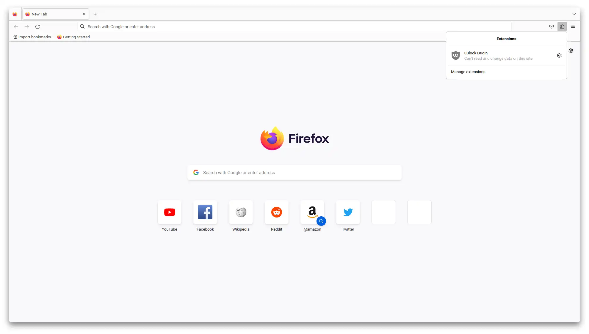

## Hide Unified Extensions Button (Firefox >111)

The `about:config` flag was removed in Firefox version 111, so extensions.unifiedExtensions.enabled flags will not work. However, you can still hide it with `userChrome.css`. We can change the **unified extension button** to `opacity: 0` with `userChrome.css`, so the button is **invisible** but still works.

1. You need to set `toolkit.legacyUserProfileCustomizations.stylesheets` to `true` from `about:config` so `userChrome.css` will work.

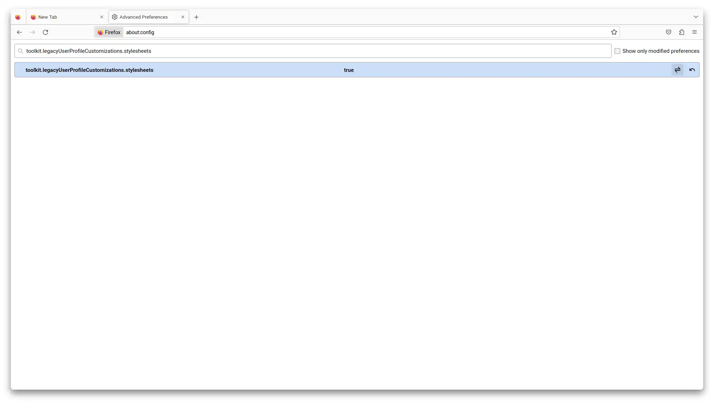

2. Open `about:support` find **Profile Directory** and click the **Open Directory** button.

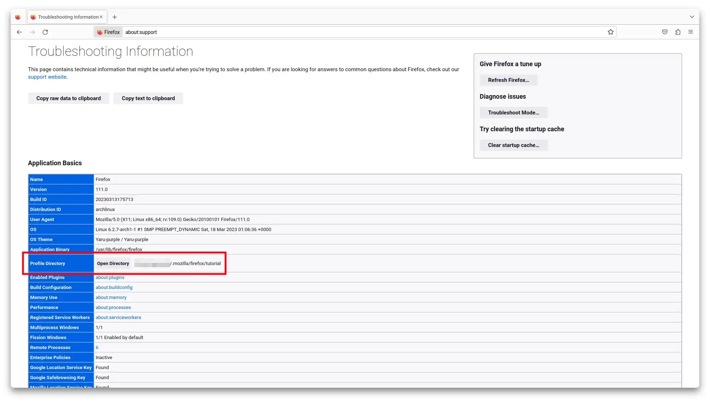

3. After File Explorer opens, **create a folder** named `chrome` under your Firefox profile directory.

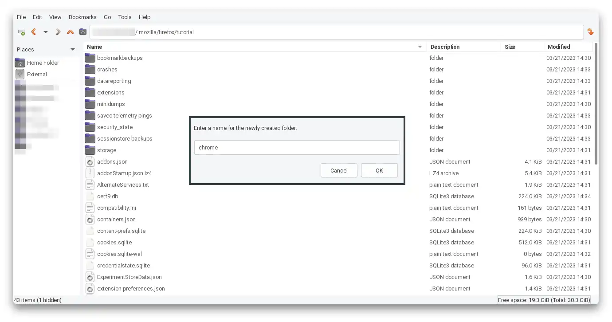

5. Open the `chrome` folder and create a file with the name `userChrome.css` (for Linux, this is case-sensitive).

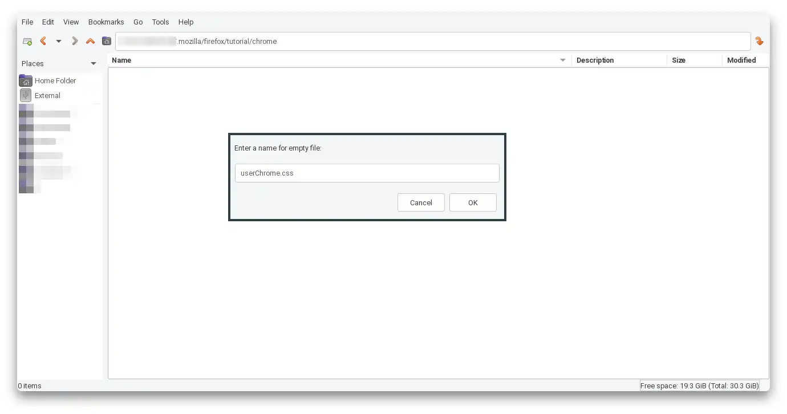

6. Open `userChrome.css` with a text editor and paste this CSS code & Save.

```css
#unified-extensions-button {
  opacity: 0 !important;
}
```

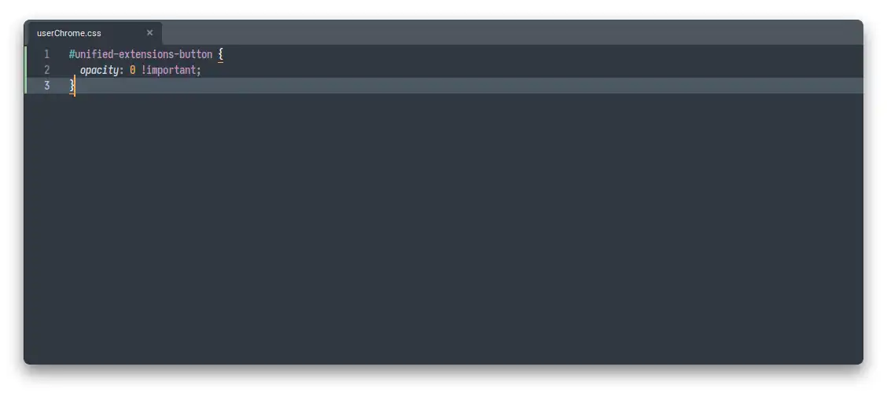

7. Open `about:restartrequired` and Restart Firefox, so your tab will not be gone.

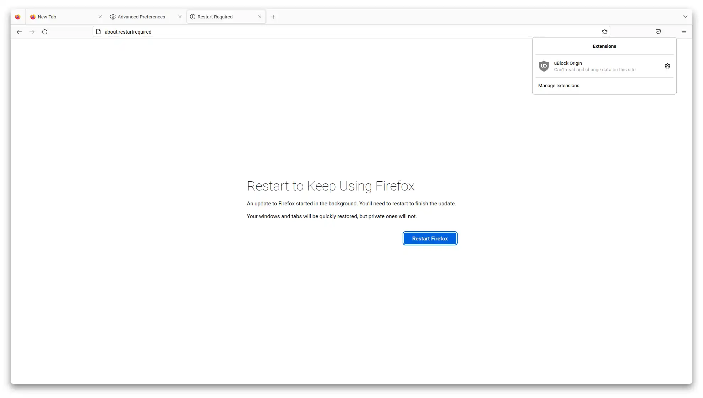

## Hide Unified Extensions Button (Firefox <110)

1. Open `about:config` & **Accept the Risk and Continue**

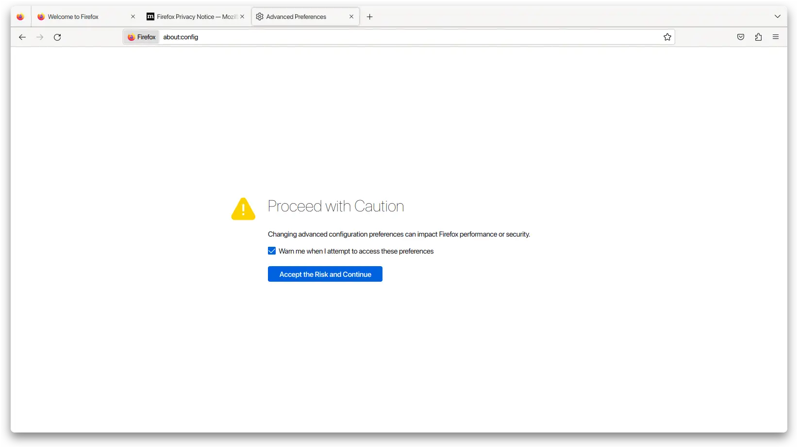

2. Search `extensions.unifiedExtensions.enabled` set to `false`

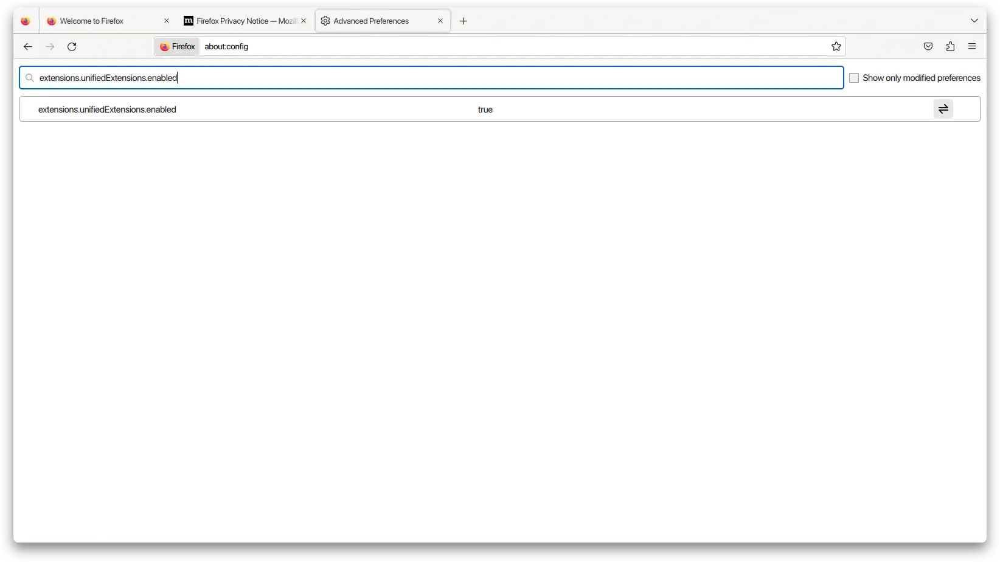 

3. Open `about:restartrequired` and **Restart Firefox**

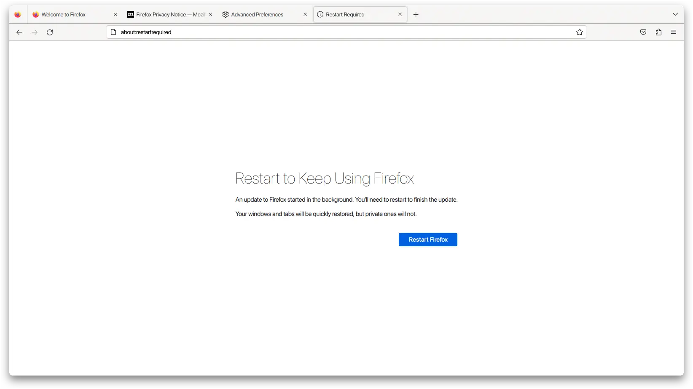

4. After restart extension button will be reverted to overflow menu like Firefox version 108 and older

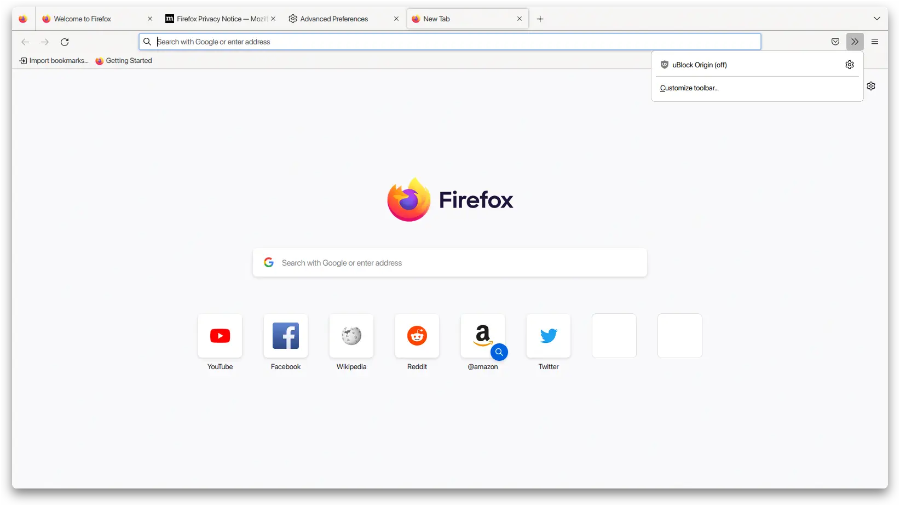

## Disable Firefox View & Tab Manager

You can read article here [Remove Firefox View & Tab Manager Firefox 106](https://rmdhnreza.my.id/remove-firefox-view-tab-manager-firefox-106/)