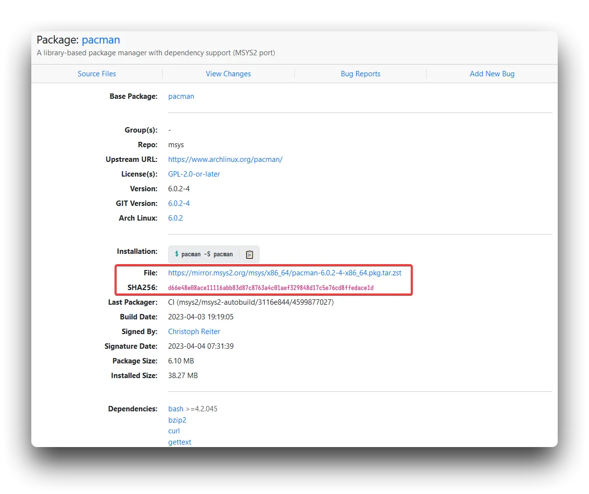
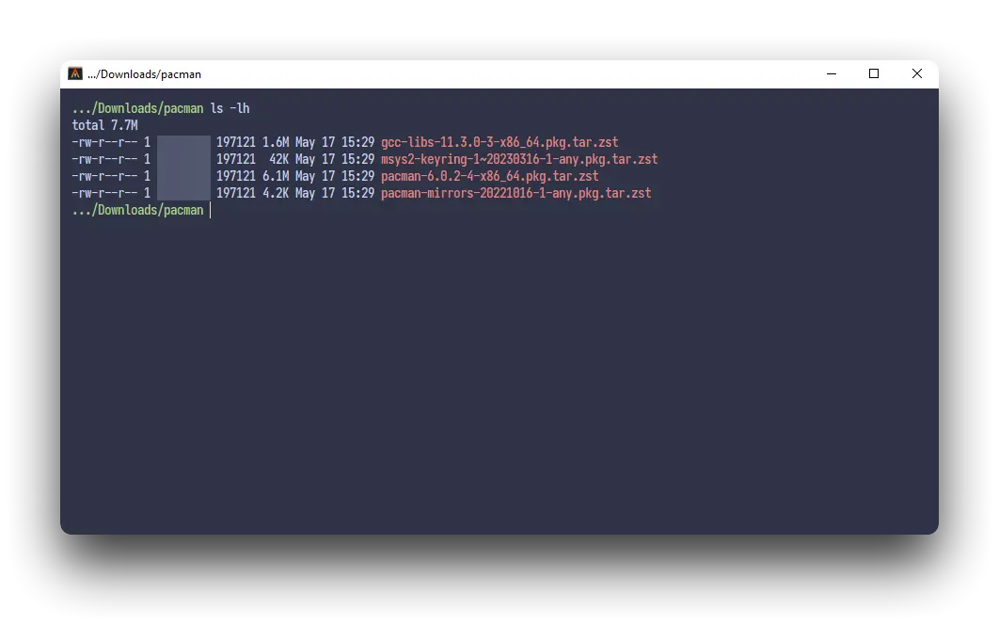
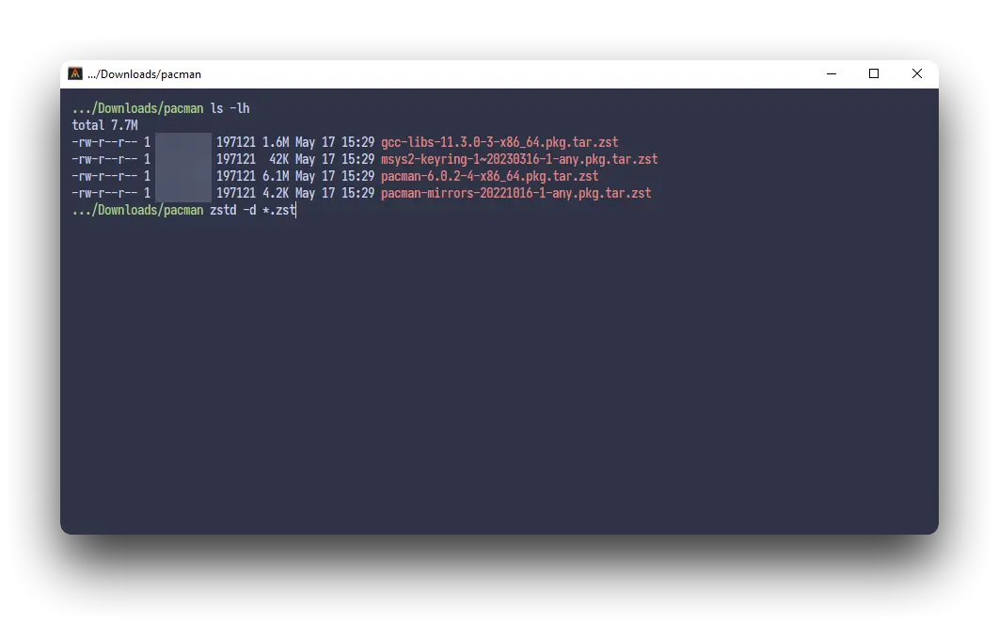
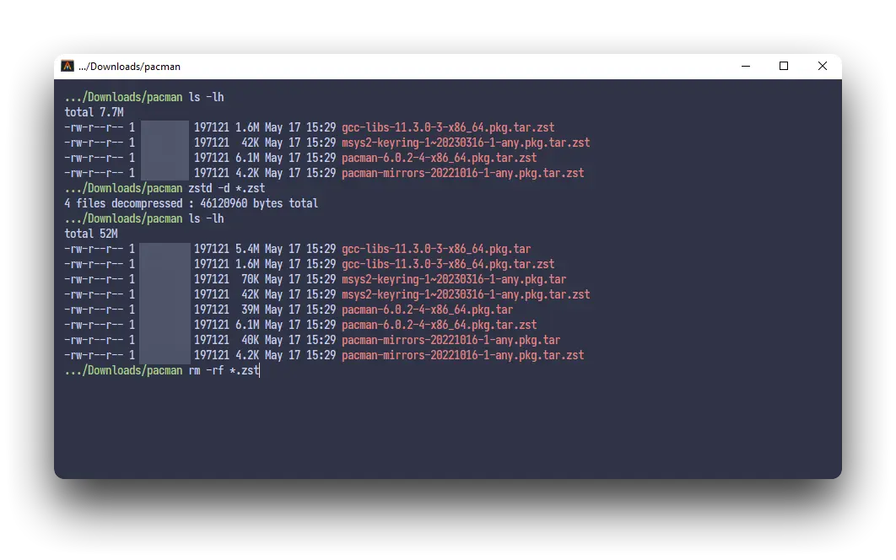
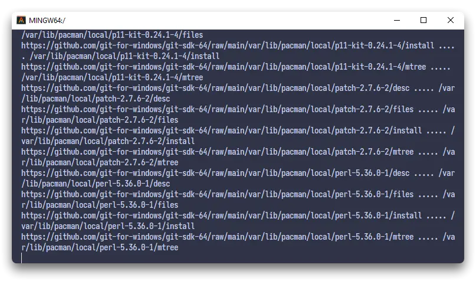
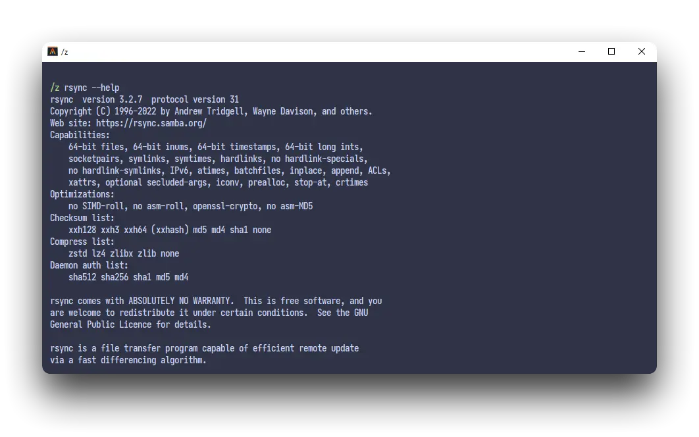
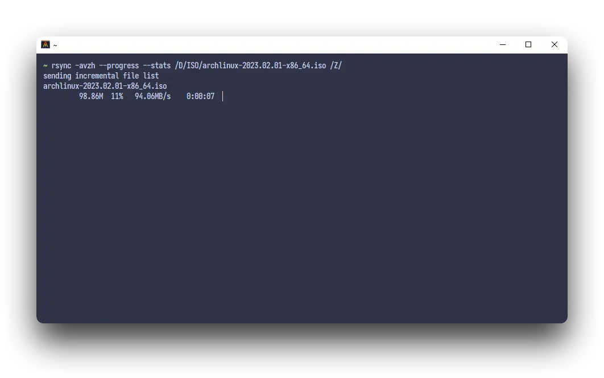
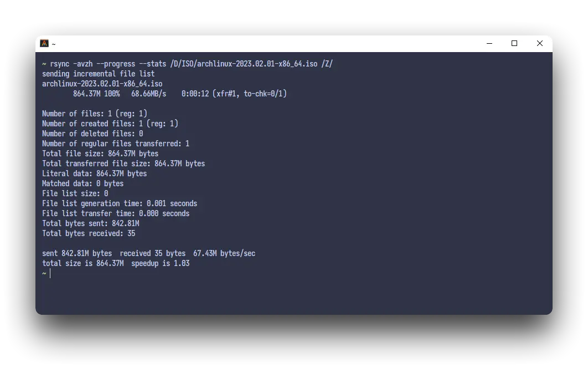

{}

Rsync is a utility for efficiently transferring and synchronizing files between a computer and a storage drive and across networked computers by comparing the modification times and sizes of files. It is commonly found on Unix-like operating systems and is under the GPL-3.0-or-later license.

Since we're using the Windows operating system, we need another tool called `Git for Windows`. Git GUI using `bash shell` by default, but before that, we need to add a repository first and in this tutorial we can use MSYS2 repository, install pacman (Arch default package manager) and install `rsync` with pacman.

## Install Git for Windows
1. Install [Git for Windows](https://git-scm.com/download/win) according to the operating system you are using whether 32/64 bit, if you are using [scoop](https://rmdhnreza.my.id/cara-menginstall-package-manager-scoop-di-windows-10/), you can use command.
```powershell
scoop install git
```
## Install Pacman
2. Download [pacman](https://packages.msys2.org/package/pacman?repo=msys), [pacman-mirrors](https://packages.msys2.org/package/pacman-mirrors?repo=msys), [msys2-keyring](https://packages.msys2.org/package/msys2-keyring?repo=msys) & [gcc-libs](https://packages.msys2.org/package/gcc-libs?repo=msys&variant=x86_64) from the MSYS2 website.



3. The files are in `zst` format. To *extract* to tar format, you can use [Windows version of zstd](https://github.com/facebook/zstd/releases), for users who use [scoop](https://rmdhnreza.my.id/cara-menginstall-package-manager-scoop-di-windows-10/) You can use the command `scoop install zstd` for installing [zstd](https://github.com/facebook/zstd/releases).
Once the [zstd](https://github.com/facebook/zstd/releases) is installed, run the following command from git GUI/PowerShell `zstd -d *.zst` after successfully *extract* will appear 4 new files with tar format
 



4. Now, we open the **Git GUI** and run the command below to *extract* the tar file into the **Git GUI root directory**.


```md
cd /
tar -xvf /D/Downloads/msys2-keyring-1~20230316-1-any.pkg.tar
tar -xvf /D/Downloads/pacman-mirrors-20221016-1-any.pkg.tar
tar -xvf /D/Downloads/pacman-6.0.2-4-x86_64.pkg.tar
tar -xvf /D/Downloads/gcc-libs-11.3.0-3-x86_64.pkg.tar
pacman-key --init
pacman-key --populate msys2
pacman -Syu
```

{} Make sure the PATH for the tar file is correct! {}

{}

5. To synchronize metadata files, you need to run the command below. This step may take a few minutes to complete, depending on your internet speed, too.

```bash
URL=https://github.com/git-for-windows/git-sdk-64/raw/main
cat /etc/package-versions.txt | while read p v; do
  d=/var/lib/pacman/local/$p-$v
  mkdir -p $d
  for f in desc files install mtree; do
    echo "$URL$d/$f" ..... $d/$f
    curl -sSL "$URL$d/$f" -o $d/$f
  done
done
```



{}

## Install Rsync

6. Once pacman is installed on **Git Bash**, `rsync` can be installed:

```bash
pacman -S rsync
```

 

7. If everything goes well and works properly, you can use the command `rsync`, The command same as command in the Linux operating system. For example, **if you want to copy a file from drive D to drive Z with progress and stats, you can use these command.**

```bash
rsync -avzh --progress --stats /D/Path/To/File.txt /Z/Path/To/Paste/
```

 

## Source

1. [https://gist.github.com/rafaelpadovezi/](https://gist.github.com/rafaelpadovezi/1cfc1026f78255458f5a2ea56291ed23)
2. [https://gist.github.com/rafaelpadovezi/#gistcomment-4325219](https://gist.github.com/rafaelpadovezi/1cfc1026f78255458f5a2ea56291ed23?permalink_comment_id=4325219#gistcomment-4325219)